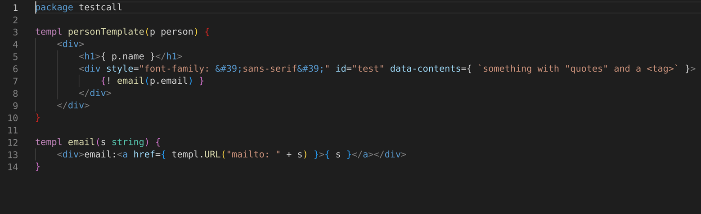

## A HTML templating language for Go that has great developer tooling.




## Documentation

See user documentation at https://templ.guide

<p align="center">
<a href="https://pkg.go.dev/github.com/a-h/templ"></a>
<a href="https://xcfile.dev"></a>
<a href="https://raw.githack.com/wiki/a-h/templ/coverage.html"></a>
<a href="https://goreportcard.com/report/github.com/a-h/templ"></a<
</p>

## Tasks

### build

Build a local version.

```sh
go run ./get-version > .version
cd cmd/templ
go build
```

### install-snapshot

Build and install to ~/bin

```sh
rm cmd/templ/lspcmd/*.txt || true
go run ./get-version > .version
cd cmd/templ && go build -o ~/bin/templ
```

### build-snapshot

Use goreleaser to build the command line binary using goreleaser.

```sh
goreleaser build --snapshot --clean
```

### generate

Run templ generate using local version.

```sh
go run ./cmd/templ generate -include-version=false
```

### test

Run Go tests.

```sh
go run ./get-version > .version
go run ./cmd/templ generate -include-version=false
go test ./...
```

### test-cover

Run Go tests.

```sh
# Create test profile directories.
mkdir -p coverage/fmt
mkdir -p coverage/generate
mkdir -p coverage/unit
# Build the test binary.
go build -cover -o ./coverage/templ-cover ./cmd/templ
# Run the covered generate command.
GOCOVERDIR=coverage/fmt ./coverage/templ-cover fmt .
GOCOVERDIR=coverage/generate ./coverage/templ-cover generate -include-version=false
# Run the unit tests.
go test -cover ./... -args -test.gocoverdir="$PWD/coverage/unit"
# Display the combined percentage.
go tool covdata percent -i=./coverage/fmt,./coverage/generate,./coverage/unit
# Generate a text coverage profile for tooling to use.
go tool covdata textfmt -i=./coverage/fmt,./coverage/generate,./coverage/unit -o coverage.out
# Print total
go tool cover -func coverage.out | grep total
```

### benchmark

Run benchmarks.

```sh
go run ./cmd/templ generate -include-version=false && go test ./... -bench=. -benchmem
```

### fmt

Format all Go and templ code.

```sh
gofmt -s -w .
go run ./cmd/templ fmt .
```

### lint

```sh
golangci-lint run --verbose
```

### release

Create production build with goreleaser.

```sh
if [ "${GITHUB_TOKEN}" == "" ]; then echo "No github token, run:"; echo "export GITHUB_TOKEN=`pass github.com/goreleaser_access_token`"; exit 1; fi
./push-tag.sh
goreleaser --clean
```

### docs-run

Run the development server.

Directory: docs

```sh
npm run start
```

### docs-build

Build production docs site.

Directory: docs

```sh
npm run build
```

