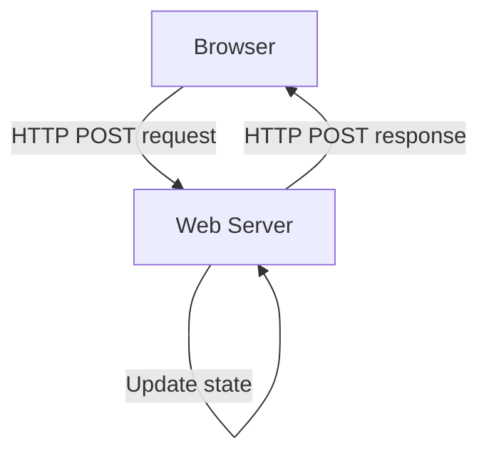

# Example: Counter application

Web applications typically need to store application state, some of which is per-user, and some of which is global.

Applications also need to handle input from users, update the state, and display updated HTML.



## Updating global state

First, define a HTML form post with two buttons. One to update a global state, and one for a per-user state.

```templ title="components.templ"
package main

import "strconv"

templ counts(global, user int) {
	<div>Global: { strconv.Itoa(global) }</div>
	<div>User: { strconv.Itoa(user) }</div>
}

templ form() {
	<form action="/" method="POST">
		<div><button type="submit" name="global" value="global">Global</button></div>
		<div><button type="submit" name="user" value="user">User</button></div>
	</form>
}

templ page(global, user int) {
	@counts(global, user)
	@form()
}
```

:::tip
While we could read the global state directly, we're following the best practice that templ components are idempotent, pure functions.
:::

The HTTP form in the templates posts data back to the `/` handler.

The `/` handler looks at the HTTP request. If it's a GET request, the templ templates are rendered by the `getHandler`.

If it's a POST request, then the `postHandler` is used. This parses the data sent over HTTP, and looks to see if the `global` button was the button that submitted the form, and increments the global count value if it was.

```go title="main.go"
package main

import (
	"fmt"
	"log"
	"net/http"
)

type GlobalState struct {
	Count int
}

var global GlobalState

func getHandler(w http.ResponseWriter, r *http.Request) {
	component := page(global.Count, 0)
	component.Render(r.Context(), w)
}

func postHandler(w http.ResponseWriter, r *http.Request) {
	// Update state.
	r.ParseForm()

	// Check to see if the global button was pressed.
	if r.Form.Has("global") {
		global.Count++
	}
	//TODO: Update session.

	// Display the form.
	getHandler(w, r)
}

func main() {
	// Handle POST and GET requests.
	http.HandleFunc("/", func(w http.ResponseWriter, r *http.Request) {
		if r.Method == http.MethodPost {
			postHandler(w, r)
			return
		}
		getHandler(w, r)
	})

	// Start the server.
	fmt.Println("listening on http://localhost:8000")
	if err := http.ListenAndServe("localhost:8000", nil); err != nil {
		log.Printf("error listening: %v", err)
	}
}
```

:::note
In this example, the global state is stored in RAM, and will be lost when the web server reboots. To support load-balanced web servers, and stateless function deployments, you might consider storing the state in a data store such as Redis, DynamoDB, or Cloud Firestore.
:::

## Adding per-user session state

In a HTTP application, per-user state information is partitioned by a HTTP cookie. Setting a cookie with a unique random value for each user (typically a V4 UUID or similar) allows the HTTP handlers to identify each user by reading the cookie value presented by the user's browser.

Cookies that identify a user while they're using a site are known as "session cookies". When the HTTP handler receives a request, it can read the session ID of the user from the cookie and retrieve any required state.

You can implement session cookies yourself, or use an existing library.

:::tip
Cookies are often used for authentication as well as for sessions.
:::

This example uses the https://github.com/alexedwards/scs library to implement per-user sessions.

```go title="main.go"
package main

import (
	"fmt"
	"log"
	"net/http"
	"time"

	"github.com/alexedwards/scs/v2"
)

type GlobalState struct {
	Count int
}

var global GlobalState
// highlight-next-line
var sessionManager *scs.SessionManager

func getHandler(w http.ResponseWriter, r *http.Request) {
	// highlight-next-line
	userCount := sessionManager.GetInt(r.Context(), "count")
	component := page(global.Count, userCount)
	component.Render(r.Context(), w)
}

func postHandler(w http.ResponseWriter, r *http.Request) {
	// Update state.
	r.ParseForm()

	// Check to see if the global button was pressed.
	if r.Form.Has("global") {
		global.Count++
	}
	// highlight-start
	if r.Form.Has("user") {
		currentCount := sessionManager.GetInt(r.Context(), "count")
		sessionManager.Put(r.Context(), "count", currentCount+1)
	}
	// highlight-end

	// Display the form.
	getHandler(w, r)
}

func main() {
	// highlight-start
	// Initialize the session.
	sessionManager = scs.New()
	sessionManager.Lifetime = 24 * time.Hour
	// highlight-end

	mux := http.NewServeMux()

	// Handle POST and GET requests.
	mux.HandleFunc("/", func(w http.ResponseWriter, r *http.Request) {
		if r.Method == http.MethodPost {
			postHandler(w, r)
			return
		}
		getHandler(w, r)
	})

	// highlight-start
	// Add the middleware.
	muxWithSessionMiddleware := sessionManager.LoadAndSave(mux)
	// highlight-end

	// Start the server.
	fmt.Println("listening on http://localhost:8000")
	if err := http.ListenAndServe("localhost:8000", muxWithSessionMiddleware); err != nil {
		log.Printf("error listening: %v", err)
	}
}
```

:::note
Incrementing a count by reading and setting the value is not an atomic operation (not thread-safe). In a production application, to increment a per-user count you may wish to use a database that provides a transactional increment operation.
:::

:::note
The default behaviour of `scs` is to store session data in RAM, which isn't suitable for stateless function deployments, or load-balanced applications, but the library supports a range of backend storage solutions.
:::

Complete source code including AWS CDK code to set up the infrastructure is available at https://github.com/a-h/templ/tree/main/examples/counter
