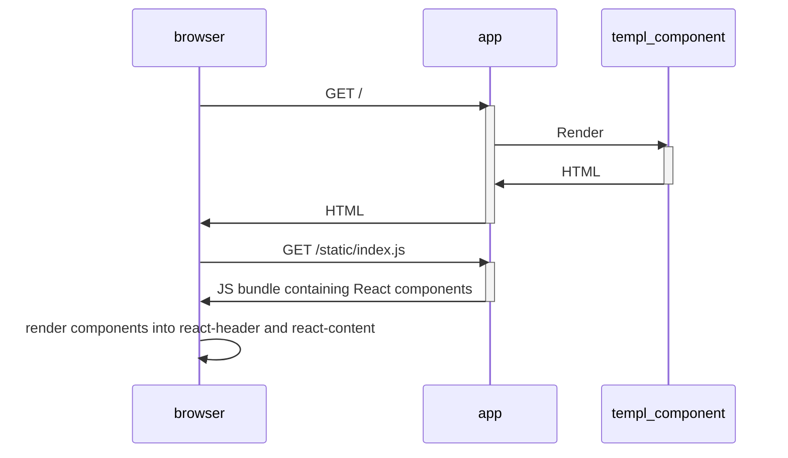

# Using React with templ

templ is great for server-side rendering. Combined with [HTMX](https://htmx.org/), it's even more powerful, since HTMX can be used to replace elements within the page with updated HTML fetched from the server, providing many of the benefits of React with reduced overall complexity. See [/server-side-rendering/htmx](/server-side-rendering/htmx) for an example.

However, React has a huge ecosystem of rich interactive components, so being able to tap into the ecosystem is very useful.

With templ, it's more likely that you will use React components as [islands of interactivity](https://www.patterns.dev/vanilla/islands-architecture/) rather than taking over all aspects of displaying your app, with templ taking over server-side rendering, but using React to provide specific features on the client side.

## Using React components

First, lets start by rendering simple React components.

### Create React components

To use React components in your templ app, create your React components using TSX (TypeScript) or JSX as usual.

```tsx title="react/components.tsx"
export const Header = () => (<h1>React component Header</h1>);

export const Body = () => (<div>This is client-side content from React</div>);
```

### Create a templ page

Next, use templ to create a page containing HTML elements with specific IDs.

:::note
This page defines elements with ids of `react-header` and `react-content`.

A `<script>` element loads in a JavaScript bundle that we haven't created yet.
:::

```templ title="components.templ"
package main

templ page() {
	<html>
		<body>
			<div id="react-header"></div>
			<div id="react-content"></div>
			<div>This is server-side content from templ.</div>
			<!-- Load the React bundle created using esbuild -->
			<script src="static/index.js"></script>
		</body>
	</html>
}
```

:::tip
Remember to run `templ generate` when you've finished writing your templ file.
:::

### Render React components into the IDs

Write TypeScript or JavaScript to render the React components into the HTML elements that are rendered by templ.

```typescript title="react/index.ts"
import { createRoot } from 'react-dom/client';
import { Header, Body } from './components';

// Render the React component into the templ page at the react-header.
const headerRoot = document.getElementById('react-header');
if (!headerRoot) {
	throw new Error('Could not find element with id react-header');
}
const headerReactRoot = createRoot(headerRoot);
headerReactRoot.render(Header());

// Add the body React component.
const contentRoot = document.getElementById('react-content');
if (!contentRoot) {
	throw new Error('Could not find element with id react-content');
}
const contentReactRoot = createRoot(contentRoot);
contentReactRoot.render(Body());
```

### Create a client-side bundle

To turn the JSX, TSX, TypeScript and JavaScript code into a bundle that can run in the browser, use a bundling tool.

https://esbuild.github.io/ is commonly used for this task. It's fast, it's easy to use, and it's written in Go.

Executing `esbuild` with the following arguments creates an `index.js` file in the static directory.

```bash
esbuild --bundle index.ts --outdir=../static --minify
```

### Serve the templ component and client side bundle

To serve the server-side rendered templ template, and the client-side JavaScript bundle created in the previous step, setup a Go web server.

```go title="main.go"
package main

import (
	"fmt"
	"log"
	"net/http"

	"github.com/a-h/templ"
)

func main() {
	mux := http.NewServeMux()

	// Serve the templ page.
	mux.Handle("/", templ.Handler(page()))

	// Serve static content.
	mux.Handle("/static/", http.StripPrefix("/static/", http.FileServer(http.Dir("static"))))

	// Start the server.
	fmt.Println("listening on localhost:8080")
	if err := http.ListenAndServe("localhost:8080", mux); err != nil {
		log.Printf("error listening: %v", err)
	}
}
```

### Results

Putting this together results in a web page that renders server-side HTML using templ. The server-side HTML includes a link to the static React bundle.



## Passing server-side data to React components

Moving on from the previous example, it's possible to pass data to client-side React components.

### Add a React component that accepts data arguments

First, add a new component.

```tsx title="react/components.tsx"
export const Hello = (name: string) => (
  <div>Hello {name} (Client-side React, rendering server-side data)</div>
);
```

### Export a JavaScript function that renders the React component to a HTML element

```typescript title="react/index.ts"
// Update the import to add the new Hello React component.
import { Header, Body, Hello } from './components';

// Previous script contents...
  
export function renderHello(e: HTMLElement) {
  const name = e.getAttribute('data-name') ?? "";
  createRoot(e).render(Hello(name));
}
```

### Update the templ component to use the new function

Now that we have a `renderHello` function that will render the React component to the given element, we can update the templ components to use it.

In templ, we can add a `Hello` component that does two things:

1. Renders an element for the React component to be loaded into that sets the `data-name` attribute to the value of the server-side `name` field.
2. Writes out JS that calls the `renderHello` function to mount the React component into the element.

:::note
The template renders three copies of the `Hello` React component, passing in a distinct `name` parameter ("Alice", "Bob" and "Charlie").
:::

```templ title="components.templ"
package main

import "fmt"

templ Hello(name string) {
	<div data-name={ name }>
		<script type="text/javascript">
			bundle.renderHello(document.currentScript.closest('div'));
		</script>
	</div>
}

templ page() {
	<html>
		<head>
			<title>React integration</title>
		</head>
		<body>
			<div id="react-header"></div>
			<div id="react-content"></div>
			<div>
				This is server-side content from templ.
			</div>
			<!-- Load the React bundle that was created using esbuild -->
			<!-- Since the bundle was coded to expect the react-header and react-content elements to exist already, in this case, the script has to be loaded after the elements are on the page -->
			<script src="static/index.js"></script>
			<!-- Now that the React bundle is loaded, we can use the functions that are in it -->
			<!-- the renderName function in the bundle can be used, but we want to pass it some server-side data -->
			for _, name := range []string{"Alice", "Bob", "Charlie"} {
				@Hello(name)
			}
		</body>
	</html>
}
```

### Update the `esbuild` command

The `bundle` namespace in JavaScript is created by adding a `--global-name` argument to `esbuild`. The argument causes any exported functions in `index.ts` to be added to that namespace.

```bash
esbuild --bundle index.ts --outdir=../static --minify --global-name=bundle
```

### Results

The HTML that's rendered is:

```html
<html>
  <head>
    <title>React integration</title>
  </head>
  <body>
    <div id="react-header"></div>
    <div id="react-content"></div>
    <div>This is server-side content from templ.</div>

    <script src="static/index.js"></script>

    <div data-name="Alice">
      <script type="text/javascript">
        // Place the React component into the parent div.
        bundle.renderHello(document.currentScript.closest('div'));
      </script>
    </div>
    <div data-name="Bob">
      <script type="text/javascript">
        // Place the React component into the parent div.
	bundle.renderHello(document.currentScript.closest('div'));
      </script>
    </div>
    <div data-name="Charlie">
      <script type="text/javascript">
        // Place the React component into the parent div.
	bundle.renderHello(document.currentScript.closest('div'));
      </script>
    </div>
  </body>
</html>
```

And the browser shows the expected content after rendering the client side React components.

```
React component Header
This is client-side content from React
This is server-side content from templ.
Hello Alice (Client-side React, rendering server-side data)
Hello Bob (Client-side React, rendering server-side data)
Hello Charlie (Client-side React, rendering server-side data)
```

## Example code

See https://github.com/a-h/templ/tree/main/examples/integration-react for a complete example.
