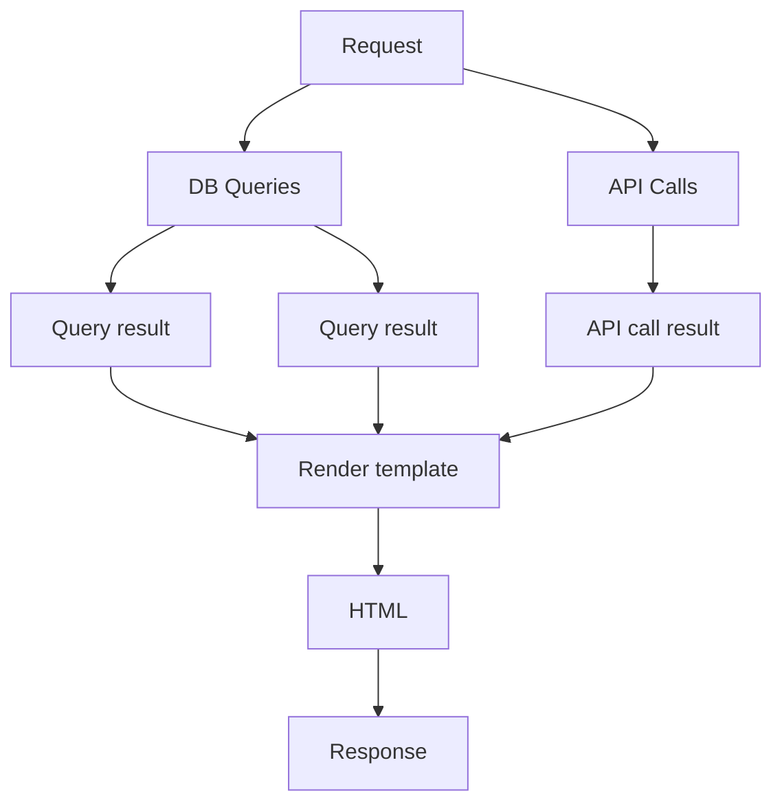

# HTTP Streaming

The default behaviour of the `templ.Handler` is to render the template to a buffer and then write the buffer to the response.

This ensures that the template has successfully rendered before the response is sent to the client, so that appropriate response codes can be set if the template fails to render, and partial responses are not sent to the client.

## Rendering lifecycle

Typical usage of templ involves collecting data that is used to populate the template, before rendering the template and sending a response.

For example, executing several database queries, calling an API, or reading from a file, before rendering the template.



However, if the queries and API calls take a long time, this has an impact on Time to First Byte (TTFB) because the client has to wait for all database queries and API calls to complete before sending the response.

To improve TTFB, the template can be streamed to the client as soon as the first part of the template is rendered, while the remaining queries and API calls are still in progress, at the cost of not being able to set response codes or headers after the first part of the template is rendered.

## Enabling streaming

Streaming can be enabled by setting the `Streaming` field of the `templ.Handler` to `true` using the `WithStreaming` option.

```go
templ.Handler(component, templ.WithStreaming()).ServeHTTP(w, r)
```

When streaming is enabled, sections of the template can be forcefully pushed to the client using the `templ.Flush()` component.

This enables interesting use cases. For example, here, the `Page` template is rendered with a channel that is populated by a background goroutine.

By using `templ.Flush()` to create a flushable area, the data is pushed to the client as soon as it is available, rather than waiting for the entire template to render before sending a response.

```go
templ Page(data chan string) {
	<!DOCTYPE html>
	<html>
		<head>
			<title>Page</title>
		</head>
		<body>
			<h1>Page</h1>
			for d := range data {
				@templ.Flush() {
					<div>{ d }</div>
				}
			}
		</body>
	</html>
}
```

See https://github.com/a-h/templ/tree/main/examples/streaming for a full example.

## Suspense

Many modern web frameworks use a concept called "Suspense" to handle the loading of data and rendering of components.

This usually involves displaying placeholder content while the data is loading, and then rendering the component when the data is available.

With JavaScript frontends like React, the lifecycle is usually that the HTML is rendered, the JS loaded, the initial render that displays the placeholder is done, an API call is made back to the server to fetch data, and then the component is rendered.

This involves a lot of extra HTTP requests, and means that we have to wait until JavaScript is loaded before we can start fetching data.

Combining templ's streaming capability with a new feature in web browsers called "Declarative Shadow DOM" means that we can perform the same action in a single HTTP request.

:::note:::
React SSR solutions such as Next.js can do this on the server, just like templ can, see https://nextjs.org/docs/app/building-your-application/routing/loading-ui-and-streaming#what-is-streaming
:::

### Declarative Shadow DOM

First, we need to define a new templ component called `Slot`.

```go
templ Slot(name string) {
	<slot name={ name }>
		<div>Loading { name }...</div>
	</slot>
}
```

This component is a placeholder that will be replaced by the contents of the slot when the data is available.

Next, we can use a `<template>` element with `shadowrootmode="open"` to create a shadow DOM that allows us to populate the `<slot>` elements with data.

We need to use `@templ.Flush()` to create a flushable area, so that the data is pushed to the client as soon as it is available, since popluating the slots will take longer to complete.

We can then use a `for` loop over the channel of data to populate the slots with content, again, flushing the results to the browser when available.

The result is a simple way to load content after initial page load without the need to use JavaScript.

```go
templ Page(data chan SlotContents) {
	<!DOCTYPE html>
	<html>
		<head>
			<title>Page</title>
		</head>
		<body>
			<h1>Page</h1>
			@templ.Flush() {
				<template shadowrootmode="open">
					@Slot("a")
					@Slot("b")
					@Slot("c")
				</template>
			}
			for sc := range data {
				@templ.Flush() {
					<div slot={ sc.Name }>
						@sc.Contents
					</div>
				}
			}
		</body>
	</html>
}
```

<video loop autoplay controls src="/img/shadowdom.webm" />

See https://github.com/a-h/templ/tree/main/examples/suspense for a full working example.
