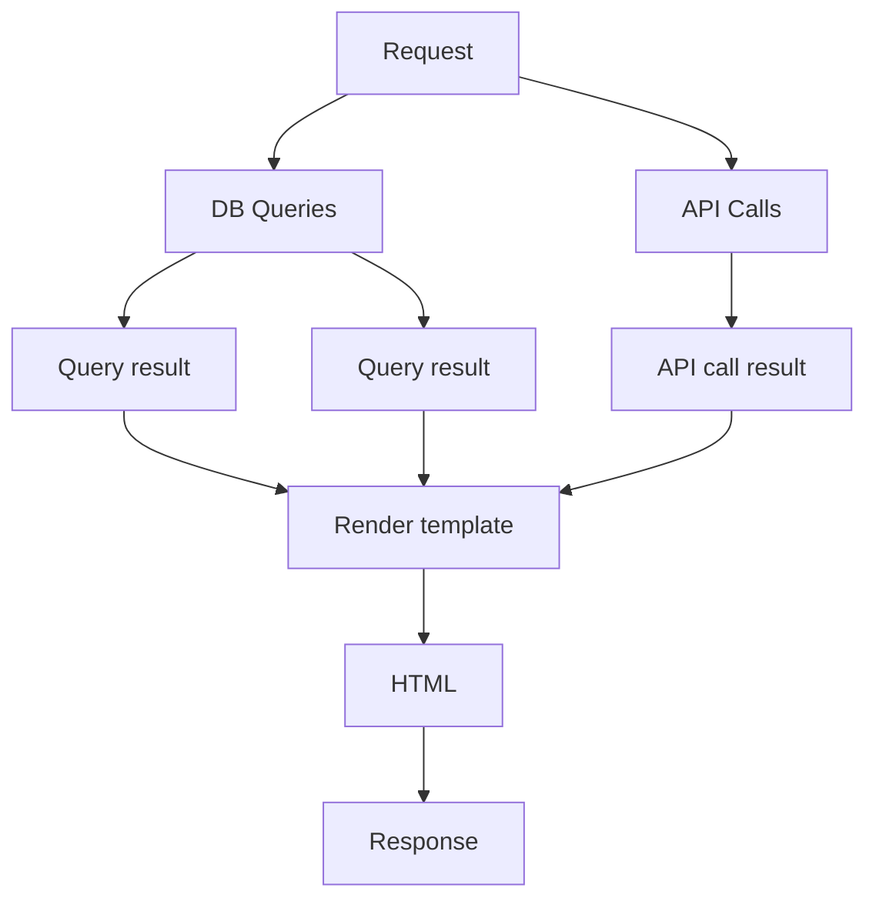

# HTTP Streaming

The default behaviour of the `templ.Handler` is to render the template to a buffer and then write the buffer to the response.

This ensures that the template has successfully rendered before the response is sent to the client, so that appropriate repsonse codes can be set if the template fails to render, and partial responses are not sent to the client.

## Rendering lifecycle

Typical usage of templ involves collecting data that is used to populate the template, before rendering the template and sending a response.

For example, executing several database queries, calling an API, or reading from a file, before rendering the template.

However, if the queries and API calls take a long time, this has an impact on Time to First Byte (TTFB) because the client has to wait for all database queries and API calls to complete before sending the response.

To improve TTFB, the template can be streamed to the client as soon as the first part of the template is rendered, while the remaining queries and API calls are still in progress, at the cost of not being able to set response codes or headers after the first part of the template is rendered.

## Enabling streaming

Streaming can be enabled by setting the `Streaming` field of the `templ.Handler` to `true`.
