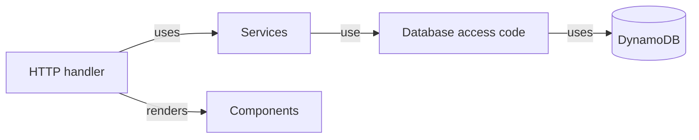

# Project structure

The example counter project demonstrates a way to structure your applications.

https://github.com/a-h/templ/tree/main/examples/counter

The application is divided up into multiple packages, each with its own purpose.

* `cdk` - Infrastructure setup for deploying the application.
* `components` - templ components.
* `db` - Database access code used to increment and get counts.
* `handlers` - HTTP handlers.
* `lambda` - The AWS Lambda entry point.
* `services` - Services used by the handlers.
* `session` - Middleware for implementing HTTP session IDs.
* `main.go` - Used to run the application locally.

## Application architecture

The architecture follows a typical "onion model" where each layer doesn't know about the layer above it, and each layer is responsible for a specific thing.



* HTTP Handler
  * Processes HTTP requests
  * Does not contain application logic itself
  * Uses `services` that carry out application logic
  * Takes the responses from `services` and uses `components` to render HTML
  * Creates HTTP responses
* Services
  * Carries out application logic such as orchestrating API calls, or making database calls
  * Does not do anything related to HTML or HTTP
  * Is not aware of the specifics of database calls
* Database access code
  * Handles database activity such as inserting and querying records
  * Ensures that the database representation (`records`) doesn't leak to the service layer

A more complex application may have a `models` package containing plain structs that represent common data structures in the application, such as `User`.

:::tip
As with most things, taking the layering approach to an extreme level can have a negative effect. Ask yourself whether what you're doing is really helping to make the code understandable, or is just spreading application logic across lots of files, and making it hard to see the overall structure.
:::

## Dependency injection

Layering an application in this way can simplify code structure, since the responsibility of each type is clear.

To ensure that each part of the application is initialized with its dependencies, each struct defines a constructor (the `New` function in this example).

As per https://go.dev/wiki/CodeReviewComments#interfaces the HTTP handler defines the interface that it's expecting, rather than the service defining its own interface.

```go title="handlers/default.go"
type CountService interface {
	Increment(ctx context.Context, it services.IncrementType, sessionID string) (counts services.Counts, err error)
	Get(ctx context.Context, sessionID string) (counts services.Counts, err error)
}

func New(log *slog.Logger, cs CountService) *DefaultHandler {
	return &DefaultHandler{
		Log:          log,
		CountService: cs,
	}
}

type DefaultHandler struct {
	Log          *slog.Logger
	CountService CountService
}
```

Changing the signature of `New` to add a new dependency will result in a compilation error that shows you all the affected code in your application.

:::tip
Dependency injection frameworks are not typically used in Go. If you're coming from a language like C# or Java, this may seem unusual to you, but go with it, you don't need one.
:::

## HTTP layer

This HTTP handler reads HTTP requests, uses the `CountService` to `Get` or `Increment` the counters, and renders the templ Components.

:::note
Note that the `View` method uses the templ Components from the `components` directory to render the page.
:::

```go "title="handlers/default.go"
func (h *DefaultHandler) ServeHTTP(w http.ResponseWriter, r *http.Request) {
	if r.Method == http.MethodPost {
		h.Post(w, r)
		return
	}
	h.Get(w, r)
}

func (h *DefaultHandler) Get(w http.ResponseWriter, r *http.Request) {
	var props ViewProps
	var err error
	props.Counts, err = h.CountService.Get(r.Context(), session.ID(r))
	if err != nil {
		h.Log.Error("failed to get counts", slog.Any("error", err))
		http.Error(w, "failed to get counts", http.StatusInternalServerError)
		return
	}
	h.View(w, r, props)
}

func (h *DefaultHandler) Post(w http.ResponseWriter, r *http.Request) {
	r.ParseForm()

	// Decide the action to take based on the button that was pressed.
	var it services.IncrementType
	if r.Form.Has("global") {
		it = services.IncrementTypeGlobal
	}
	if r.Form.Has("session") {
		it = services.IncrementTypeSession
	}

	counts, err := h.CountService.Increment(r.Context(), it, session.ID(r))
	if err != nil {
		h.Log.Error("failed to increment", slog.Any("error", err))
		http.Error(w, "failed to increment", http.StatusInternalServerError)
		return
	}

	// Display the view.
	h.View(w, r, ViewProps{
		Counts: counts,
	})
}

type ViewProps struct {
	Counts services.Counts
}

func (h *DefaultHandler) View(w http.ResponseWriter, r *http.Request, props ViewProps) {
	components.Page(props.Counts.Global, props.Counts.Session).Render(r.Context(), w)
}
```

## Service layer

The service layer coordinates API and database activity to carry out application logic.

```go title="services/count.go"
type Counts struct {
	Global  int
	Session int
}

func (cs Count) Get(ctx context.Context, sessionID string) (counts Counts, err error) {
	globalAndSessionCounts, err := cs.CountStore.BatchGet(ctx, "global", sessionID)
	if err != nil {
		err = fmt.Errorf("countservice: failed to get counts: %w", err)
		return
	}
	if len(globalAndSessionCounts) != 2 {
		err = fmt.Errorf("countservice: unexpected counts returned, expected 2, got %d", len(globalAndSessionCounts))
	}
	counts.Global = globalAndSessionCounts[0]
	counts.Session = globalAndSessionCounts[1]
	return
}
```

This allows us to use Go's parallelism features to run operations more efficiently without adding complexity to the HTTP or database code.

```go title="services/count.go"
func (cs Count) Increment(ctx context.Context, it IncrementType, sessionID string) (counts Counts, err error) {
	// Work out which operations to do.
	var global, session func(ctx context.Context, id string) (count int, err error)
	switch it {
	case IncrementTypeGlobal:
		global = cs.CountStore.Increment
		session = cs.CountStore.Get
	case IncrementTypeSession:
		global = cs.CountStore.Get
		session = cs.CountStore.Increment
	default:
		return counts, ErrUnknownIncrementType
	}

	// Run the operations in parallel.
	var wg sync.WaitGroup
	wg.Add(2)
	errs := make([]error, 2)
	go func() {
		defer wg.Done()
		counts.Global, errs[0] = global(ctx, "global")
	}()
	go func() {
		defer wg.Done()
		counts.Session, errs[1] = session(ctx, sessionID)
	}()
	wg.Wait()

	return counts, errors.Join(errs...)
}
```

## Entrypoint

To wire all of the dependencies together and start up your web server or serverless function handler, your application will require an entrypoint.

In this example, the code for configuring the HTTP server and HTTP routes is also in the `main.go` because it's a very simple application. In more complex applications, this might be migrated into another package.

```go title="main.go"
package main

import (
	"fmt"
	"net/http"
	"os"
	"time"

	"github.com/a-h/templ/examples/counter/db"
	"github.com/a-h/templ/examples/counter/handlers"
	"github.com/a-h/templ/examples/counter/services"
	"github.com/a-h/templ/examples/counter/session"
	"golang.org/x/exp/slog"
)

func main() {
	log := slog.New(slog.NewJSONHandler(os.Stderr))
	s, err := db.NewCountStore(os.Getenv("TABLE_NAME"), os.Getenv("AWS_REGION"))
	if err != nil {
		log.Error("failed to create store", slog.Any("error", err))
		os.Exit(1)
	}
	cs := services.NewCount(log, s)
	h := handlers.New(log, cs)

	var secureFlag = true
	if os.Getenv("SECURE_FLAG") == "false" {
		secureFlag = false
	}

	// Add session middleware.
	sh := session.NewMiddleware(h, session.WithSecure(secureFlag))

	server := &http.Server{
		Addr:         "localhost:9000",
		Handler:      sh,
		ReadTimeout:  time.Second * 10,
		WriteTimeout: time.Second * 10,
	}

	fmt.Printf("Listening on %v\n", server.Addr)
	server.ListenAndServe()
}
```
