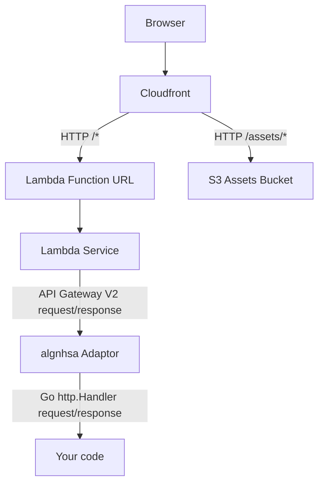

# Hosting on AWS Lambda

AWS Lambda is a great way to host templ applications.

The example at https://github.com/a-h/templ/tree/main/examples/counter includes AWS CDK code for deploying onto AWS Lambda.

See the `/cdk` directory for the details.

## Entrypoint

Lambda functions require an entrypoint that receives Lambda requests, and returns Lambda responses.

The https://github.com/akrylysov/algnhsa package provides an adaptor that allows the standard Go HTTP interface to be used.

```go title="lambda/main.go"
package main

import (
	"os"

	"github.com/a-h/templ/examples/counter/db"
	"github.com/a-h/templ/examples/counter/handlers"
	"github.com/a-h/templ/examples/counter/services"
	"github.com/a-h/templ/examples/counter/session"
	"github.com/akrylysov/algnhsa"
	"golang.org/x/exp/slog"
)

func main() {
	// Create handlers.
	log := slog.New(slog.NewJSONHandler(os.Stderr))
	s, err := db.NewCountStore(os.Getenv("TABLE_NAME"), os.Getenv("AWS_REGION"))
	if err != nil {
		log.Error("failed to create store", slog.Any("error", err))
		os.Exit(1)
	}
	cs := services.NewCount(log, s)
	h := handlers.New(log, cs)

	// Add session middleware.
	sh := session.NewMiddleware(h)

	// Start Lambda.
	algnhsa.ListenAndServe(sh, nil)
}
```

## Building and deploying

CDK provides the `github.com/aws/aws-cdk-go/awscdklambdagoalpha/v2` package (aliased in this code as `awslambdago`) construct.

All that's required is to pass the path to the directory containing your Lambda function's `main.go` file and CDK will compile the code and deploy it.

```go title="cdk/stack.go"
// Strip the binary, and remove the deprecated Lambda SDK RPC code for performance.
// These options are not required, but make cold start faster.
bundlingOptions := &awslambdago.BundlingOptions{
  GoBuildFlags: &[]*string{jsii.String(`-ldflags "-s -w" -tags lambda.norpc`)},
}
f := awslambdago.NewGoFunction(stack, jsii.String("handler"), &awslambdago.GoFunctionProps{
  Runtime:      awslambda.Runtime_PROVIDED_AL2(),
  MemorySize:   jsii.Number(1024),
  Architecture: awslambda.Architecture_ARM_64(),
  Entry:        jsii.String("../lambda"),
  Bundling:     bundlingOptions,
  Environment: &map[string]*string{
    "TABLE_NAME": db.TableName(),
  },
})
// Add a Function URL.
lambdaURL := f.AddFunctionUrl(&awslambda.FunctionUrlOptions{
  AuthType: awslambda.FunctionUrlAuthType_NONE,
})
awscdk.NewCfnOutput(stack, jsii.String("lambdaFunctionUrl"), &awscdk.CfnOutputProps{
  ExportName: jsii.String("lambdaFunctionUrl"),
  Value:      lambdaURL.Url(),
})
```

## Static content

To serve static content such as images alongside Lambda functions that serve HTML or REST API responses, a common pattern is to use a CloudFront distribution that routes traffic to S3 or to the Lambda Function URL, based on the URL structure.



The example CDK stack includes a deployment process that updates the contents of the S3 bucket.

## Deployed example

To see the deployed sample application running on AWS Lambda, visit https://d3qfg6xxljj3ky.cloudfront.net
