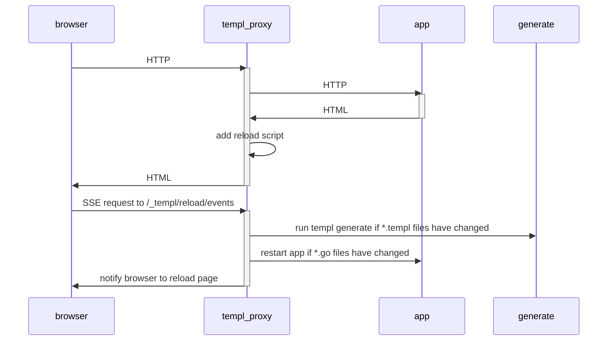

# Live reload

To enable live reload on a `templ` app use:

```bash
templ generate --watch --proxy="http://localhost:8080" --cmd="go run ."
```

This will:

- Automatically re-generate Go code if you change `*.templ` files.
- Restart the web server if you change `*.go` files.
- Automatically reload the browser if you change `*.go` or `*.templ` files.
- Run a HTTP proxy on `localhost:7331` (by default) that proxies requests to your web server (default `http://localhost:8080`).

## Example

Create `main.go` and `hello.templ` files.

```go title="main.go"
package main

import (
	"fmt"
	"net/http"

	"github.com/a-h/templ"
)

func main() {
	component := hello("World")

	http.Handle("/", templ.Handler(component))

	fmt.Println("Listening on :8080")
	http.ListenAndServe(":8080", nil)
}
```

```templ title="hello.templ"
package main

templ hello(name string) {
  <body>
	    <div>Hello, { name }</div>
  </body>
}
```

Run `templ generate --watch --proxy="http://localhost:8080" --cmd="go run ."`.

Observe that the web server is started, and the browser opens to `http://localhost:7331`.

Make changes to `hello.templ` and `main.go`, and see the changes reflected in the browser without having to press F5.

## How it works

### templ watches files for changes

The `templ generate --watch` argument tells `templ` to watch for changes to `*.templ` and `*.go` files in the current directory.

When a change is detected, `templ` will:

- Automatically generate `*.go` code from your `*.templ` files when you save changes to them.
- Create text files in the `tmp` directory that is read by generated templ Go code if the `TEMPL_DEV_MODE` enabled.
  - This means that the Go web server doesn't need to be restarted when changes are made to HTML or text in `*.templ` files, `templ` can read the files at runtime instead.
  - The web server is only restarted when changes are made to Go code in `*.templ` files.

### templ restarts your server automatically

The `--cmd` argument tells `templ` to run a command when `*.go` files change, for example:

```bash
templ generate --watch --cmd="go run ."
```

The command is executed if `*.go` files change, or if any Go code within `*.templ` files change.

You can run any command you like, e.g. `go build -o app && ./app`, or `air`, or `wgo`.

### templ uses a proxy to auto-reload the browser

The `--proxy` argument tells `templ` to run a HTTP proxy that proxies requests to your web server.

For example, if your web server listens on port 8080:

```bash
templ generate --watch --cmd="go run ." --proxy="http://localhost:8080"
```

This starts a HTTP proxy that proxies requests to your web server (default `http://localhost:7331`). The proxy inserts client-side JavaScript before the `</body>` tag that will cause the browser to reload the window when the app is restarted instead of you having to reload the page manually - no more pressing F5!

By default, the proxy binds to `127.0.0.1:7331`. You can use `--proxybind` to bind to another address, e.g., `--proxybind="0.0.0.0"`.

:::note
In order for templ to successfully inject the reload JavaScript into the HTML response:

- The HTML must have a `<body>` tag.
- The HTML must be served with a `Content-Type` of `text/html`.
- The response must be compressed with no compression, or a supported compression algorithm (e.g. gzip).
:::

## Live reload process

The live reload process can be shown in the following diagram:



### Triggering live reload from outside `templ generate --watch`

If you want to trigger a live reload from outside `templ generate --watch` (e.g. if you're using `air`, `wgo` or another tool to build, but you want to use the templ live reload proxy), you can use the `--notify-proxy` argument.

```bash
templ generate --notify-proxy
```

This will default to the default templ proxy address of `localhost:7331`, but can be changed with the `--proxybind` and `--proxyport` arguments.

```bash
templ generate --notify-proxy --proxybind="localhost" --proxyport="8080"
```

## Alternatives

If you don't want to use `templ generate --watch`, you can use other tools to watch for changes and restart the server.

### wgo

[wgo](https://github.com/bokwoon95/wgo):

> Live reload for Go apps. Watch arbitrary files and respond with arbitrary commands. Supports running multiple invocations in parallel.

```
wgo -file=.go -file=.templ -xfile=_templ.go templ generate :: go run main.go
```

To avoid a continuous reloading files ending with `_templ.go` should be skipped via `-xfile`.

### air

Air can also monitor the filesystem for changes, and provides a proxy to automatically reload pages.

It uses a `toml` configuration file.

See https://github.com/air-verse/air for details.

#### Example configuration

```toml title=".air.toml"
root = "."
tmp_dir = "tmp"

[build]
  bin = "./tmp/main"
  cmd = "templ generate && go build -o ./tmp/main ."
  delay = 1000
  exclude_dir = ["assets", "tmp", "vendor"]
  exclude_file = []
  exclude_regex = [".*_templ.go"]
  exclude_unchanged = false
  follow_symlink = false
  full_bin = ""
  include_dir = []
  include_ext = ["go", "tpl", "tmpl", "templ", "html"]
  kill_delay = "0s"
  log = "build-errors.log"
  send_interrupt = false
  stop_on_error = true

[color]
  app = ""
  build = "yellow"
  main = "magenta"
  runner = "green"
  watcher = "cyan"

[log]
  time = false

[misc]
  clean_on_exit = false

[proxy]
  enabled = true
  proxy_port = 8383
  app_port = 8282
```
