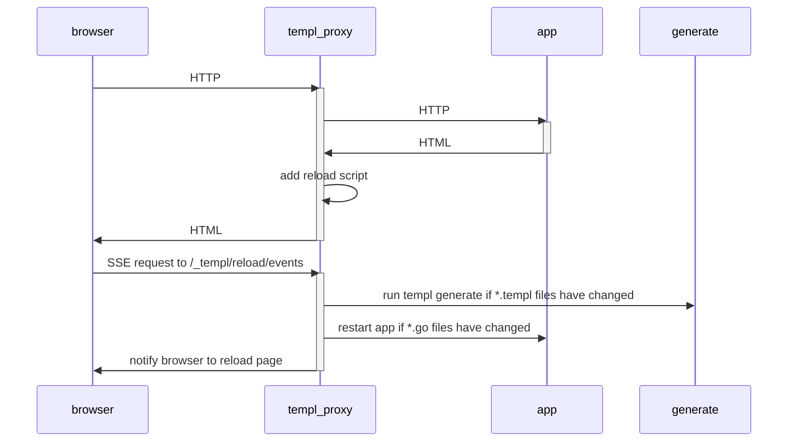

# Live reload

To access a Go web application that uses templ in a web browser, a few things must happen:

1. `templ generate` must be executed, to create Go code (`*_templ.go` files) from the `*.templ` files.
2. The Go code must start a web server on a port, e.g. (`http.ListenAndServe("localhost:8080", nil)`.
3. The Go program must be ran, e.g. by running `go run .`.
4. The web browser must access or reload the page, e.g. `http://localhost:8080`.

If the `*.templ` files change, #1 and #2 must be ran.

If the `*.go` files change, #3 and #4 must be ran.

## Built-in

`templ generate --watch` watches the current directory for changes and generates Go code if changes are detected.

To re-run your app automatically, add the `--cmd` argument to `templ generate`, and templ will start or restart your app using the command provided once template code generation is complete (#3).

To trigger your web browser to reload automatically (without pressing F5), set the `--proxy` argument (#4) to point at your app, and browse to the proxy address (default `http://localhost:7331`).

The `--proxy` argument starts a HTTP proxy which proxies requests to your app. For example, if your app runs on port 8080, you would use `--proxy="http://localhost:8080"`. The proxy inserts client-side JavaScript before the `</body>` tag that will cause the browser to reload the window when the app is restarted instead of you having to reload the page manually. Note that the html being served by the webserver MUST have a `<body>` tag, otherwise there will be no javascript injection thus making the browser not reload automatically.

By default, the proxy binds to `127.0.0.1`. You can use `--proxybind` to bind to another address, e.g., `--proxybind="0.0.0.0"`.

Altogether, to setup live reload on an app that listens on port 8080, run the following.

```
templ generate --watch --proxy="http://localhost:8080" --cmd="go run ."
```

This will start the proxy server on port `7331` and open it in your default browser. If you'd like to prevent it from opening in your browser add the flag `--open-browser=false`.

```go title="main.go"
package main

import (
	"fmt"
	"net/http"

	"github.com/a-h/templ"
)

func main() {
	component := hello("World")

	http.Handle("/", templ.Handler(component))

	fmt.Println("Listening on :8080")
	http.ListenAndServe(":8080", nil)
}
```

```templ title="hello.templ"
package main

templ hello(name string) {
  <body>
	    <div>Hello, { name }</div>
  </body>
}
```

The live reload process can be shown in the following diagram:



### Triggering live reload from outside `templ generate --watch`

If you want to trigger a live reload from outside `templ generate --watch` (e.g. if you're using `air`, `wgo` or another tool to build, but you want to use the templ live reload proxy), you can use the `--notify-proxy` argument.

```bash
templ generate --notify-proxy
```

This will default to the default templ proxy address of `localhost:7331`, but can be changed with the `--proxybind` and `--proxyport` arguments.

```bash
templ generate --notify-proxy --proxybind="localhost" --proxyport="8080"
```

## Alternative 1: wgo

[wgo](https://github.com/bokwoon95/wgo):

> Live reload for Go apps. Watch arbitrary files and respond with arbitrary commands. Supports running multiple invocations in parallel.

```
wgo -file=.go -file=.templ -xfile=_templ.go templ generate :: go run main.go
```

To avoid a continous reloading files ending with `_templ.go` should be skipped via `-xfile`.

## Alternative 2: air

Air can also monitor the filesystem for changes, and provides a proxy to automatically reload pages.

It uses a `toml` configuration file.

See https://github.com/cosmtrek/air for details.

### Example configuration

```toml title=".air.toml"
root = "."
tmp_dir = "tmp"

[build]
  bin = "./tmp/main"
  cmd = "templ generate && go build -o ./tmp/main ."
  delay = 1000
  exclude_dir = ["assets", "tmp", "vendor"]
  exclude_file = []
  exclude_regex = [".*_templ.go"]
  exclude_unchanged = false
  follow_symlink = false
  full_bin = ""
  include_dir = []
  include_ext = ["go", "tpl", "tmpl", "templ", "html"]
  kill_delay = "0s"
  log = "build-errors.log"
  send_interrupt = false
  stop_on_error = true

[color]
  app = ""
  build = "yellow"
  main = "magenta"
  runner = "green"
  watcher = "cyan"

[log]
  time = false

[misc]
  clean_on_exit = false

[proxy]
  enabled = true
  proxy_port = 8383
  app_port = 8282
```
